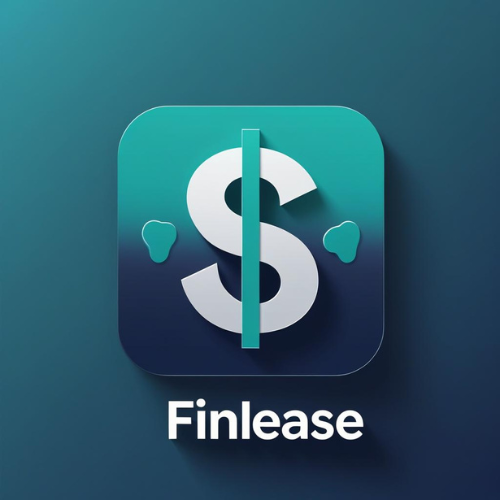

# 💰 FinTrack - Personal Finance Management App

A full-stack **MERN Stack** application designed for managing personal finances, including income, expenses, savings goals, budgets, and financial reports.

🌐 **Live Site:**  
[https://fineasmanagmentapp.netlify.app/](https://fineasmanagmentapp.netlify.app/)

📦 **GitHub Repository:**  
[https://github.com/hakimcolor/FinEaseUIIIIIIIIIIIIIIIIIIIIIIIII---Personal-Finance-Management-App](https://github.com/hakimcolor/FinEaseUIIIIIIIIIIIIIIIIIIIIIIIII---Personal-Finance-Management-App)

---

## 📸 Preview



---

## 🚀 Quick Start

```bash
npm install
npm run dev
```

Application runs on: `http://localhost:5173`

---

## 🔐 Admin Credentials

### Primary Admin:

```
Email: admin@fintrack.com
Password: Admin@123456
```

---

## 📍 Dashboard Routes

### User Dashboard

- **URL:** `/user-dashboard`
- **Access:** All authenticated users
- **Features:**
  - Financial Overview (Income, Expense, Balance)
  - Quick Actions
  - Financial Health Score
  - Spending Overview
  - Savings Goals
  - Financial Insights
  - Recent Transactions

### Admin Dashboard

- **URL:** `/admin-dashboard`
- **Access:** Users with role="admin" only
- **Features:**
  - User Management (View all users)
  - Role Assignment (Change user roles)
  - Category Management (CRUD operations)
  - Financial Reports Monitoring (Platform-wide statistics)
  - Featured Financial Tips Management (CRUD operations)

---

## 🛣️ All Routes

### Public Routes:

- `/` - Home page
- `/signin` - Login
- `/signup` - Register
- `/about` - About page
- `/features` - Features
- `/contact` - Contact

### Protected Routes (User):

- `/user-dashboard` - User dashboard
- `/add-transaction` - Add transaction
- `/my-transactions` - View transactions
- `/reports` - Financial reports
- `/budget-planning` - Budget management
- `/myprofile` - User profile
- `/transaction-details/:id` - Transaction details
- `/update-transaction/:id` - Edit transaction

### Protected Routes (Admin):

- `/admin-dashboard` - Admin control panel

---

## 🛠️ Tech Stack

### Frontend

- **Framework:** React 19.2.0
- **Build Tool:** Vite 7.2.4
- **Styling:** Tailwind CSS 4.1.17
- **Routing:** React Router DOM 7.9.6
- **Charts:** Chart.js 4.5.1 + React-Chartjs-2 5.3.1
- **Animations:** Framer Motion 12.24.10
- **HTTP:** Axios 1.13.2
- **Auth:** Firebase 12.6.0
- **Notifications:** React Hot Toast 2.6.0
- **Alerts:** SweetAlert2 11.26.10
- **Icons:** React Icons 5.5.0

### Backend

- Node.js + Express.js
- MongoDB (Atlas)
- RESTful APIs

---

## 🔧 Environment Variables

Create `.env` file:

```env
VITE_BACKEND_API=http://localhost:3000
VITE_FIREBASE_API_KEY=your_firebase_api_key
VITE_FIREBASE_AUTH_DOMAIN=your_firebase_auth_domain
VITE_FIREBASE_PROJECT_ID=your_firebase_project_id
VITE_FIREBASE_STORAGE_BUCKET=your_firebase_storage_bucket
VITE_FIREBASE_MESSAGING_SENDER_ID=your_firebase_sender_id
VITE_FIREBASE_APP_ID=your_firebase_app_id
```

---

## 🎯 Role-Based Access

### Normal User (role: "user"):

- ✅ Access User Dashboard
- ✅ Manage own transactions
- ✅ Create savings goals
- ✅ Set budgets
- ✅ View reports
- ❌ Cannot access Admin Dashboard

### Admin (role: "admin"):

- ✅ Access Admin Dashboard
- ✅ Manage all users & roles
- ✅ Manage categories & tips
- ✅ All user permissions

---

## ✨ Core Features

- ✅ Secure User Authentication (Firebase)
- ✅ Transaction CRUD (Add, Edit, Delete)
- ✅ Category-based Tracking
- ✅ Search & Filter Transactions
- ✅ Financial Dashboard with Charts
- ✅ Savings Goals Tracker
- ✅ Budget Planning with Alerts
- ✅ Smart Financial Insights
- ✅ Monthly Reports & Analytics
- ✅ Dark/Light Mode Support
- ✅ Fully Responsive (Mobile, Tablet, Desktop)

---

## 🚀 Build for Production

```bash
npm run build
```

Output: `dist/` folder

---

## 🎉 Project Status

**Status:** ✅ Complete & Ready
