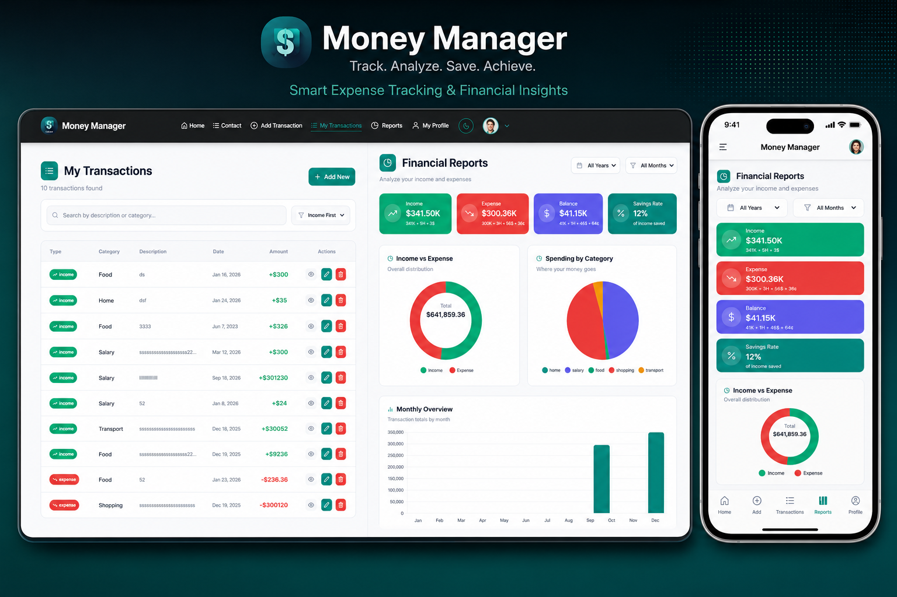

# FinEas - Personal Finance Management App



Live Demo: [https://fineasmanagmentapp.netlify.app](https://fineasmanagmentapp.netlify.app)

---

FinEas is a personal finance management web app built with React and Vite. Track your income and expenses, set savings goals, plan budgets, and get smart financial insights — all in one place.

---

## Installation

Clone the repository and install dependencies:

```bash
git clone https://github.com/hakimcolor/FinEaseUIIIIIIIIIIIIIIIIIIIIIIIII---Personal-Finance-Management-App.git
cd FinEaseUIIIIIIIIIIIIIIIIIIIIIIIII---Personal-Finance-Management-App
npm install
```

Create a `.env` file in the root with the following variables:

```env
VITE_BACKEND_API=http://localhost:3000
VITE_FIREBASE_API_KEY=your_firebase_api_key
VITE_FIREBASE_AUTH_DOMAIN=your_firebase_auth_domain
VITE_FIREBASE_PROJECT_ID=your_firebase_project_id
VITE_FIREBASE_STORAGE_BUCKET=your_firebase_storage_bucket
VITE_FIREBASE_MESSAGING_SENDER_ID=your_firebase_sender_id
VITE_FIREBASE_APP_ID=your_firebase_app_id
```

Start the development server:

```bash
npm run dev
```

App runs at: `http://localhost:5173`

Build for production:

```bash
npm run build
```

---

## Features

### User

- Transaction Management (Add, Edit, Delete)
- Category-based Expense Tracking
- Search and Filter Transactions
- Financial Dashboard with Charts
- Savings Goals Tracker
- Budget Planning with Alerts
- Smart Financial Insights
- Monthly Reports and Analytics

### Admin

- User Management and Role Assignment
- Category CRUD Operations
- Platform-wide Financial Monitoring
- Featured Financial Tips Management
- Full access to all user features

---

## Routes

### Public

- `/` - Home
- `/signin` - Login
- `/signup` - Register
- `/about` - About
- `/features` - Features
- `/contact` - Contact

### Protected (User)

- `/user-dashboard` - Dashboard
- `/add-transaction` - Add transaction
- `/my-transactions` - View all transactions
- `/reports` - Reports and analytics
- `/budget-planning` - Budget management
- `/myprofile` - Profile settings
- `/transaction-details/:id` - Transaction detail
- `/update-transaction/:id` - Edit transaction

### Protected (Admin)

- `/admin-dashboard` - Admin control panel

---

## Tech Stack

- React 19 + Vite
- Tailwind CSS 4
- React Router DOM 7
- Firebase (Auth)
- Chart.js + React-Chartjs-2
- Framer Motion
- Axios
- React Hook Form
- SweetAlert2 + React Hot Toast

---

## Responsive Design

Fully responsive across mobile (320px+), tablet, and desktop.

---

## Admin Credentials (Demo)

```
Email: hakimcolor777@gmail.com
Password: 012345678HaKIM#
```
